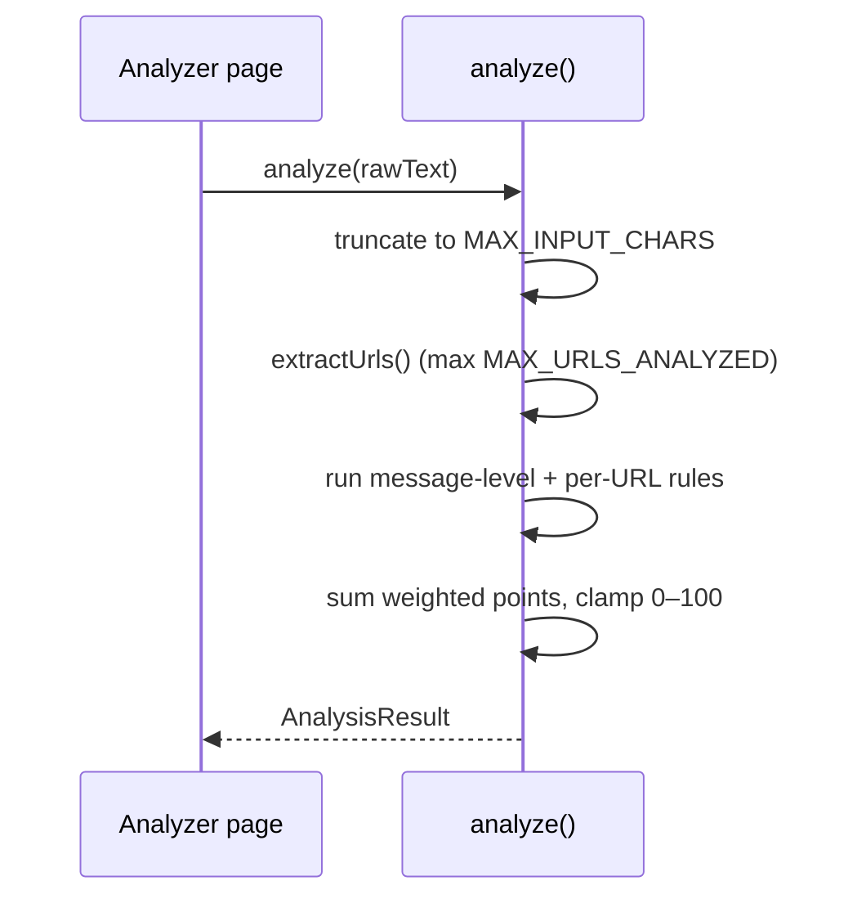

# AegisX — API Reference

| | |
|---|---|
| **Document type** | API / Interface Reference |
| **Version** | 1.0 |
| **Related documents** | [`TRD.md`](./TRD.md) · [`BACKEND_SCHEMA.md`](./BACKEND_SCHEMA.md) |

AegisX has no network API today — all "API" calls are plain in-browser function calls. This document is
the contract reference for those functions, written in a request/response style on purpose: it is the
exact shape a future REST endpoint (Phase 2, see `IMPLEMENTATION_PLAN.md`) would need to replicate, so the
UI layer would not need to change when a real backend is introduced — only the call site inside
`pages/Analyzer.tsx` would swap a function call for a network call.

---

## 1. `analyze(input: string): AnalysisResult`

**Module:** `src/lib/riskEngine.ts`



### Request

| Field | Type | Notes |
|---|---|---|
| `input` | `string` | Raw pasted text or URL. No required format. |

### Response — `AnalysisResult`

```ts
interface AnalysisResult {
  input: string          // the (possibly truncated) text actually analysed
  urlsFound: string[]    // up to MAX_URLS_ANALYZED links extracted from input
  indicators: Indicator[] // every matched rule, most severe first
  score: number           // 0–100
  level: "Low" | "Medium" | "High"
  guidance: string[]      // ordered, level-specific action steps
  truncated: boolean       // true if input exceeded MAX_INPUT_CHARS
}

interface Indicator {
  id: string              // stable identifier, e.g. "brand-mismatch"
  label: string           // short human-readable name
  detail: string          // plain-language explanation
  severity: "low" | "medium" | "high"
  points: number          // contribution to the score
}
```

### Error modes

| Condition | Behaviour |
|---|---|
| Empty/whitespace-only input | Returns a `Low`-level result with zero indicators (never throws) |
| Extremely long input | Transparently truncated to `MAX_INPUT_CHARS`; `truncated: true` |
| Malformed URL inside the text | Flagged as its own `url-unparseable` indicator, does not throw |
| Any input, including adversarial/fuzzed strings | Guaranteed not to throw — see `riskEngine.hardening.test.ts` |

### Future REST equivalent (proposed, Phase 2)

```
POST /api/v1/analyze
Content-Type: application/json

{ "input": "<pasted text>" }

200 OK
{ "urlsFound": [...], "indicators": [...], "score": 0-100, "level": "Low|Medium|High", "guidance": [...] }
```

**Note carried from `BACKEND_SCHEMA.md`:** if this endpoint is ever built, the raw `input` field must
**not** be logged or persisted server-side — only the derived `score`/`level`/`indicator` IDs, and only
for users who opt into history.

## 2. `extractUrls(text: string): string[]`

**Module:** `src/lib/riskEngine.ts`. Pure function; given free text, returns de-duplicated URLs, including
bare domains with no `http://`/`www.` prefix (e.g. `scam-site.xyz/path`) as long as the domain ends in a
recognised TLD. Used internally by `analyze()`; exported separately because it's independently unit-tested
(`riskEngine.test.ts`).

## 3. Local storage "API"

Not a network API, but the closest thing AegisX has to a persistence layer today — documented here for
completeness since it's the other half of the data contract. Full shapes and validation rules are in
[`BACKEND_SCHEMA.md`](./BACKEND_SCHEMA.md) Part A.

| Function | Module | Purpose |
|---|---|---|
| `loadStats()` / `recordAnalysis()` / `recordQuiz()` / `recordScenario()` / `clearStats()` | `lib/stats.ts` | Read/update/clear the anonymous session counters |
| `getPrefs()` / `setPrefs()` / `resetPrefs()` | `lib/prefs.ts` | Read/update/clear theme & text-size preference |

Every read validates the stored value against an expected shape before trusting it (see `SECURITY.md`);
none of these functions ever touch the network.
