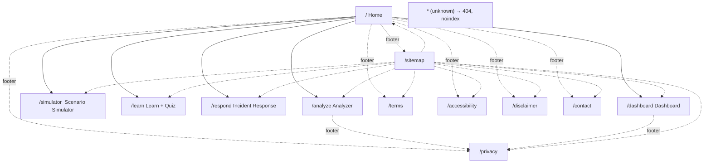
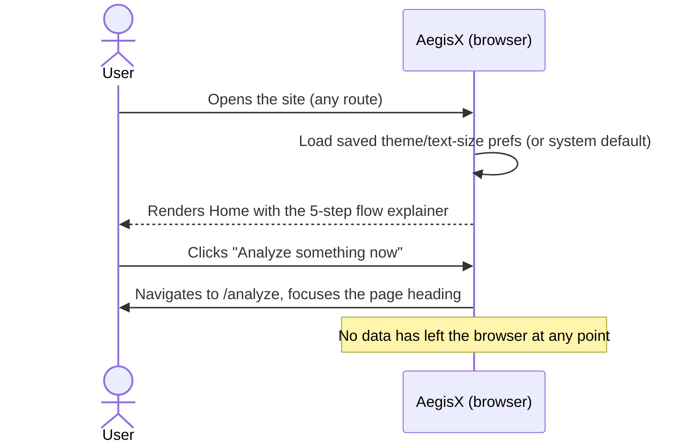
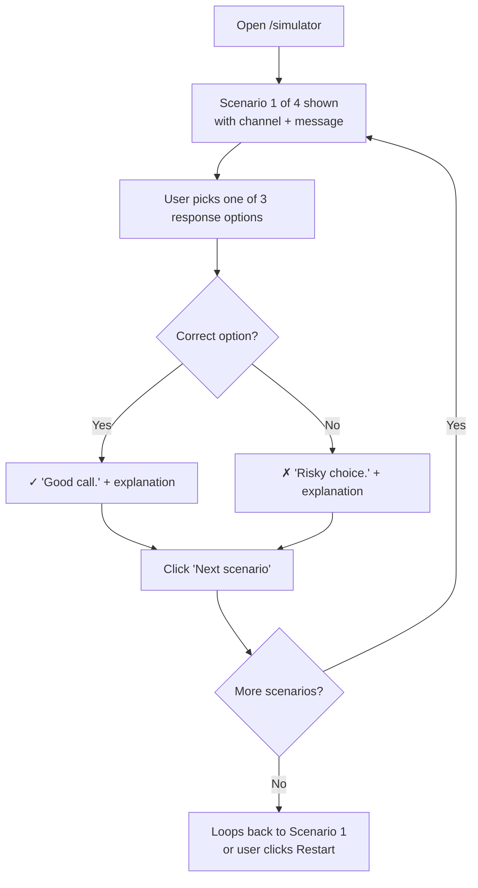
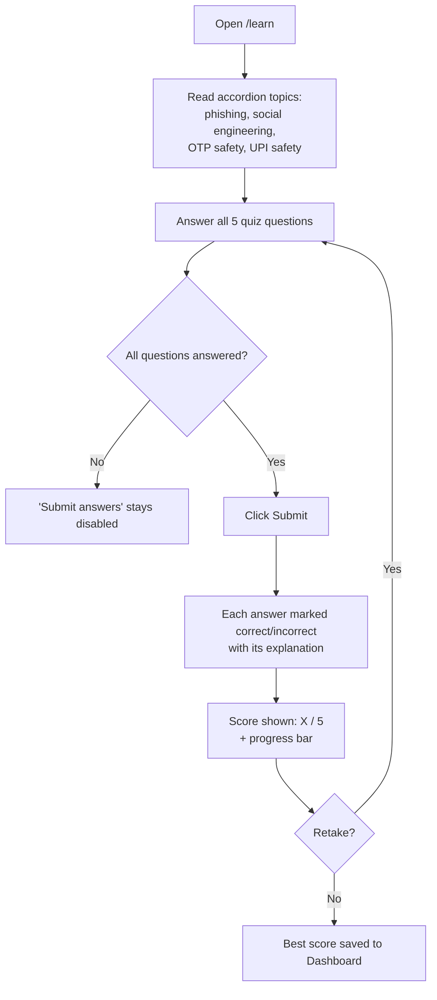
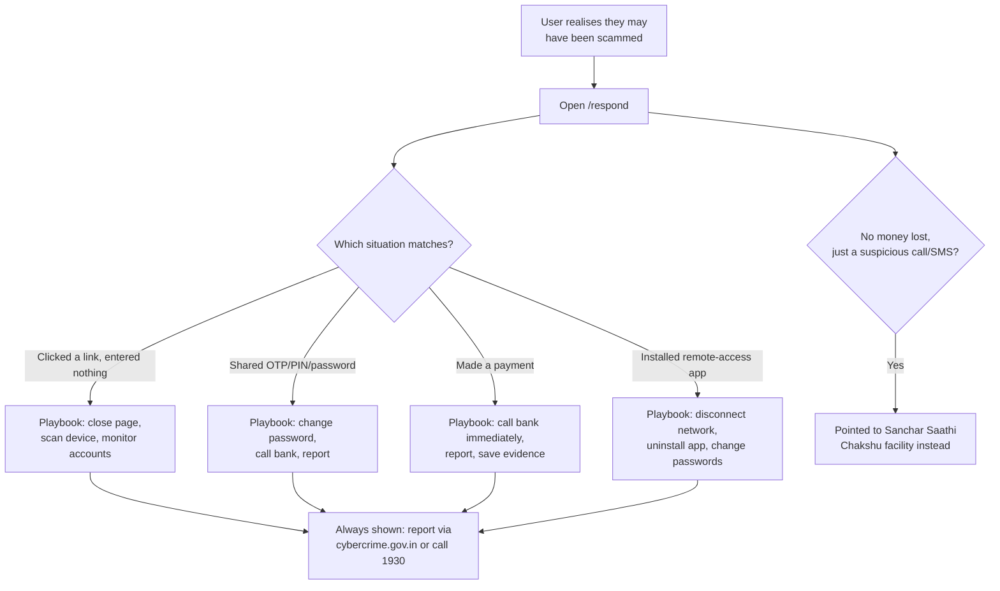
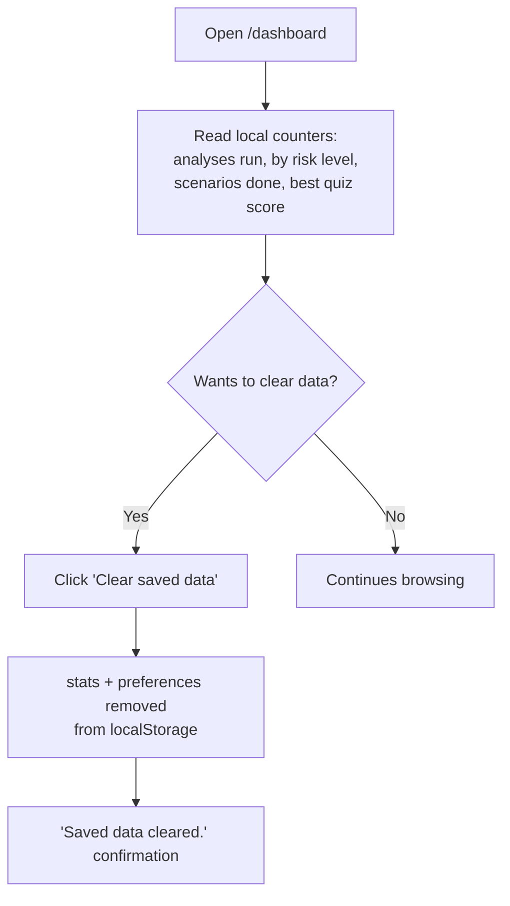
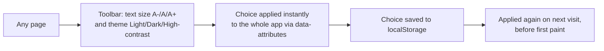

# AegisX — App Flow Document

| | |
|---|---|
| **Document type** | App Flow / User Journey Document |
| **Version** | 1.0 |
| **Related documents** | [`PRD.md`](./PRD.md) · [`UI_UX.md`](./UI_UX.md) · [`ARCHITECTURE.md`](./ARCHITECTURE.md) |

This document maps every screen, navigation path, and decision point in AegisX. It is the reference for
"what happens when the user does X" during design, development, and QA.

---

## 1. Site map

Every page shares the same shell: **Accessibility toolbar → Top nav → page content → Footer with policy
links**. Navigation is handled by an in-house router (`lib/router.tsx`) using real browser history, so
every route is directly loadable and shareable as a URL.

## 2. First-time visit flow

## 3. Core flow — Analyzer (the primary use case)

```mermaid
flowchart TD
    Start([User has a suspicious\nmessage or link]) --> Paste[Paste into the Analyzer textarea]
    Paste --> Check{Input non-empty?}
    Check -- No --> Disabled["'Check this' button stays disabled"]
    Check -- Yes --> Click[Click 'Check this']
    Click --> Cap{Over MAX_INPUT_CHARS?}
    Cap -- Yes --> Truncate[Analyze first N characters;\nshow 'input was truncated' note]
    Cap -- No --> Analyze[Run analyze&#40;&#41; synchronously]
    Truncate --> Analyze
    Analyze --> Extract[Extract up to 10 URLs\nfrom the text]
    Extract --> Rules[Run per-URL and\nper-message rule checks]
    Rules --> Score[Sum weighted indicator points,\ncap at 100]
    Score --> Level{Score thresholds}
    Level -- "< 18" --> Low[Low risk]
    Level -- "18–44" --> Medium[Medium risk]
    Level -- "&ge; 45" --> High[High risk]
    Low --> Render[Render: banner, risk meter,\nnamed indicators, guidance list]
    Medium --> Render
    High --> Render
    Render --> Record[Record Low/Medium/High count\nin local Dashboard stats only]
    Render --> Decision{User acts on guidance}
    Decision -->|Still unsure| Learn2[Visits Learn for more context]
    Decision -->|Already affected| Respond2[Visits Respond playbook]
```

## 4. Scenario Simulator flow

## 5. Learn + Quiz flow

## 6. Respond (incident response) flow

## 7. Dashboard & data-control flow

## 8. Accessibility toolbar flow

## 9. Error and edge-case states

| Situation | What the user sees |
|---|---|
| Unknown URL | A "Page not found" screen with links to Home and Sitemap; the page is marked `noindex` |
| Pasted input over the character cap | Only the first `MAX_INPUT_CHARS` characters are analysed; a note says so |
| JavaScript disabled | A `<noscript>` message pointing to cybercrime.gov.in and 1930 |
| A rendering bug anywhere | The `ErrorBoundary` shows a calm fallback with the 1930 helpline instead of a blank page |
| `localStorage` unavailable (private browsing, quota) | Reads/writes fail silently; the app continues to work, just without persistence |
| Navigating via browser Back/Forward | Handled by the router's `popstate` listener — behaves like native navigation |
