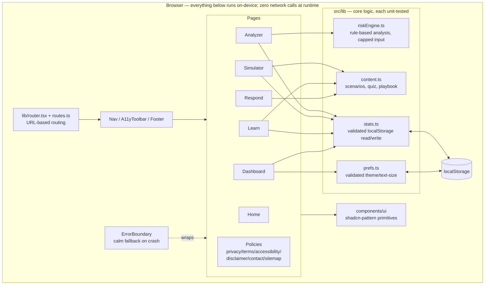
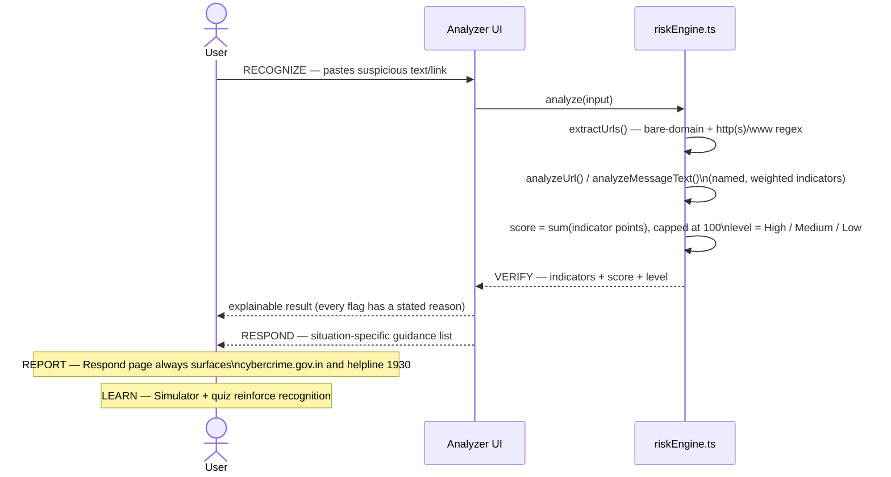

# AegisX — Technical Design Document

## 1. Overview

AegisX is a **client-only** single-page application. For the hackathon MVP there is
deliberately no backend, no database, and no network call required for the app's core
function: a citizen pastes a message or link, and a transparent rule engine — running
entirely in their browser — returns an explainable risk assessment and guidance.

This keeps the prototype low-resource, fast on any device, and privacy-preserving by
construction (nothing typed into the Analyzer ever leaves the device). Section 9 below
describes how this evolves into a networked, production-grade system.

## 2. System context

## 3. Application architecture (production)

## 4. Core data flow — RECOGNIZE → VERIFY → RESPOND → REPORT → LEARN

The hackathon proposal's five-stage flow maps onto the running app like this:

## 5. Module breakdown

| Module | Purpose | Input | Processing | Output |
|---|---|---|---|---|
| **Router** (`lib/routes.ts`, `lib/router.tsx`) | Real URL-based routing (each page has its own path, works on direct load/refresh) without adding a router dependency | Browser URL / link clicks | `pageFromPath()` maps a path to a page id; `history.pushState`/`popstate` keep the URL and UI in sync | Current page id, a `Link` component, document title + noindex handling for unknown routes |
| **App shell** (`App.tsx`, `Nav.tsx`, `Footer.tsx`, `A11yToolbar.tsx`) | Page chrome and accessibility controls | Selected route | Renders nav/footer/toolbar; on navigation, moves focus to the new page's heading for screen-reader users | Consistent shell around every page |
| **Analyzer** (`pages/Analyzer.tsx`) | Entry point for risk checking | Pasted text/URL (capped length) | Calls `analyze()`, renders result | Risk banner, meter, indicator list, guidance |
| **Risk Engine** (`lib/riskEngine.ts`) | Rule-based, explainable detection | Raw string (capped at `MAX_INPUT_CHARS`) | URL extraction (bounded to `MAX_URLS_ANALYZED` links) → per-URL checks (IP host, HTTPS, `@` trick, punycode, shorteners, risky TLD, subdomain depth, hyphen/brand mismatch, encoded query) + per-message checks (urgency, credential requests, money hooks, remote-access asks, authority impersonation, generic greeting) → weighted scoring | `{ score, level, indicators[], guidance[], truncated }` |
| **Simulator** (`pages/Simulator.tsx`, `lib/content.ts`) | Practice recognising scams in context | Scenario choice | Static scenario data + chosen-option lookup | Correct/incorrect feedback with reasoning |
| **Learn** (`pages/Learn.tsx`, `lib/content.ts`) | Awareness education + self-check | Accordion state, quiz answers | Local answer-vs-key comparison | Explained quiz score |
| **Respond** (`pages/Respond.tsx`, `lib/content.ts`) | Incident response guidance | Situation (all shown) | Static playbook lookup | Ordered remediation steps + official reporting channels (cybercrime.gov.in, 1930, Chakshu) |
| **Dashboard** (`pages/Dashboard.tsx`, `lib/stats.ts`) | Session-level self-awareness + data control | Read from `localStorage` (validated, see Section 7) | Aggregate counts; "Clear saved data" wipes stats + preferences | Stat cards; a working data-deletion control |
| **Policy pages** (`pages/Policies.tsx`, `components/PolicyLayout.tsx`) | The mandatory policy set referenced by GIGW 3.0 | — | Static content | Privacy Policy, Terms of Use, Accessibility Statement, Disclaimer/Copyright/Hyperlinking, Contact & Feedback, Sitemap |
| **Preferences** (`lib/prefs.ts`) | Text size + theme (light/dark/high-contrast), applied before first paint | User toolbar choice or stored value | Validates any stored value against a known set before applying it | Applied `data-*` attributes on `<html>`, persisted to `localStorage` |
| **Error boundary** (`components/ErrorBoundary.tsx`) | Contain rendering crashes | A thrown error anywhere in the tree | React error-boundary lifecycle | Calm fallback screen with the 1930 helpline, instead of a blank page |
| **UI primitives** (`components/ui/*`) | Consistent, accessible presentation | — | Radix UI behaviour + Tailwind styling via `cva`/`cn()` | Button, Card, Badge, Progress, Alert, Accordion, Input, Textarea |

## 6. Risk scoring model

Each matched indicator has a **severity** (`low` / `medium` / `high`) and a fixed point
value (`8` / `20` / `50`). Points sum and are capped at 100.

- **High indicators are individually decisive** (score ≥ 45 on their own) — e.g. a direct
  OTP/PIN request, a brand name paired with a look-alike domain, an `@`-trick redirect, a
  request to install a remote-access app. These are patterns with essentially no
  legitimate use in consumer messaging.
- **Medium/low indicators accumulate** — e.g. a URL shortener alone is only cautionary
  (`Medium`), and a single weak signal like a non-HTTPS link or an unusual TLD stays
  `Low` unless it combines with something else.
- **Thresholds:** score ≥ 45 → **High**, score ≥ 18 → **Medium**, else **Low**.

This mirrors the proposal's requirement that the score be an **advisory heuristic**, not
a fraud verdict, while still being strict enough to flag the highest-confidence patterns
on their own. See [`docs/SAMPLE_DATA.md`](./SAMPLE_DATA.md) and
`src/lib/riskEngine.test.ts` for worked examples and their expected classification.

## 7. Security & privacy posture (production)

AegisX remains **client-only** (no accounts, no backend, no database), which removes an entire class of
server-side attack surface by construction. On top of that, the production build adds:

- **HTTP security headers** on every response, set in [`vercel.json`](../vercel.json): a strict
  Content-Security-Policy (no `unsafe-inline`/`unsafe-eval`, no wildcard sources), HSTS,
  `X-Frame-Options: DENY`, `X-Content-Type-Options: nosniff`, `Referrer-Policy: no-referrer`, a locked-down
  `Permissions-Policy`, and `Cross-Origin-Opener-Policy`/`Cross-Origin-Resource-Policy`. Verified by an
  automated test against the actual config (`src/lib/security.test.ts`) and against a real running server
  (`scripts/serve-secure.test.mjs`).
- **No third-party network calls at runtime.** The Atkinson Hyperlegible font is self-hosted
  (`@fontsource/atkinson-hyperlegible`) rather than fetched from Google Fonts, so the page makes zero
  outbound requests once loaded — enforced by a source-scan test that fails if `fetch`, `XMLHttpRequest`,
  `sendBeacon`, `WebSocket` or `EventSource` ever appear in application code.
- **No dangerous DOM sinks.** `dangerouslySetInnerHTML`, `.innerHTML =`, `insertAdjacentHTML`, `eval`, and
  `new Function` are all checked for and forbidden by an automated source scan.
- **All locally stored data is treated as untrusted input.** `localStorage` can be edited by the user,
  by browser extensions, or shared across people on a public computer. `lib/stats.ts` and `lib/prefs.ts`
  validate every field's type and range before use, cap the stored value's size, and are specifically
  tested against malformed JSON, wrong types, out-of-range numbers, and prototype-pollution payloads
  (`__proto__`/`constructor` injection).
- **Bounded, fuzz-tested input handling in the risk engine.** Input is capped at `MAX_INPUT_CHARS`
  characters and at most `MAX_URLS_ANALYZED` links are analysed per submission, regardless of how much
  text is pasted. `src/lib/riskEngine.hardening.test.ts` fuzzes the engine with hundreds of random
  Unicode/control-character strings and specifically targets regex-backtracking (ReDoS) shapes, asserting
  every run completes in well under a second and never throws.
- **A working "forget me" control.** The Dashboard's "Clear saved data" button removes every local
  storage key AegisX uses — there is no account to delete because there was never one to begin with.
- **Dependency hygiene.** `npm audit --omit=dev --audit-level=high` runs in CI on every push (see
  [`.github/workflows/ci.yml`](../.github/workflows/ci.yml)), and Dependabot opens weekly update PRs.
- **Automated accessibility testing.** axe-core runs against every route in all three colour themes with
  zero violations (`src/App.a11y.test.tsx`) — accessibility is treated as a testable regression, not a
  one-time pass.
- **Graceful failure.** A top-level error boundary shows a calm message with the 1930 helpline instead of
  a blank screen if a rendering bug ever occurs.

See [`SECURITY.md`](../SECURITY.md) for the full threat/mitigation table and the vulnerability-disclosure
process, and [`docs/COMPLIANCE.md`](./COMPLIANCE.md) for an honest, section-by-section comparison against
GIGW 3.0, the DPDP Act/Rules, and CERT-In's incident-reporting framework — including what is **not** yet
done (multilingual support, third-party security audit, formal certification).

## 8. Deployment & CI/CD

- **Hosting:** static build (`npm run build` → `dist/`), deployable to any static host. See
  [`docs/DEPLOY_VERCEL.md`](./DEPLOY_VERCEL.md) for the free-tier Vercel walkthrough this project ships
  with (`vercel.json` supplies build settings, security headers, and SPA routing).
- **Continuous integration:** every push and pull request runs lint → tests → build → server-security
  tests → dependency audit via GitHub Actions (`.github/workflows/ci.yml`), the same `npm run check`
  sequence you can run locally.
- **Dependency updates:** Dependabot opens weekly PRs for both npm packages and GitHub Actions versions
  (`.github/dependabot.yml`).
- **Local production parity:** `npm run preview:secure` serves the real `dist/` build through the exact
  headers and SPA-rewrite logic Vercel applies in production, so header or routing regressions are
  caught before deploying, not after.

## 9. Future scalability

| Concern | MVP (now) | Production path |
|---|---|---|
| Detection logic | Client-side rule engine | Same rules as a versioned service (Flask/FastAPI or Node), so logic updates don't require an app release |
| Data | None persisted server-side | PostgreSQL for user accounts/history, if a login is ever introduced |
| Threat intel | Static curated lists in code | Pluggable feed ingestion (domain blocklists, shortener registries) refreshed server-side |
| NLP | Keyword/pattern matching | Optional local or hosted NLP model behind the same `analyze()` interface, for explanation quality, not as the sole verdict |
| Deployment | Static build (any static host/CDN) | Containerised API + CDN-hosted frontend |
| Reach | Single web app | Browser extension, mobile app, multilingual UI |

The `analyze()` function's input/output contract is intentionally simple
(`string in → { score, level, indicators, guidance } out`) so it can be swapped for a
networked implementation later without changing any page component.
