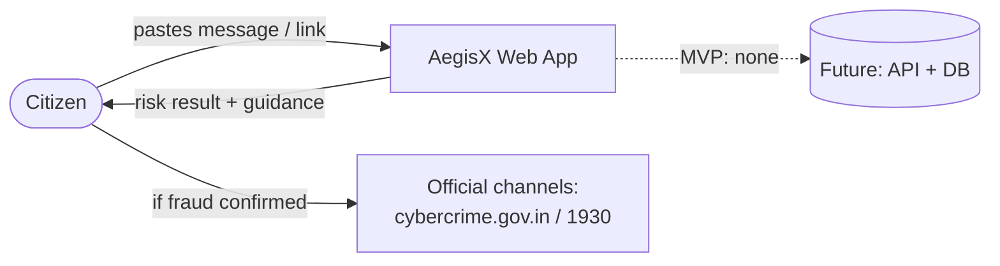
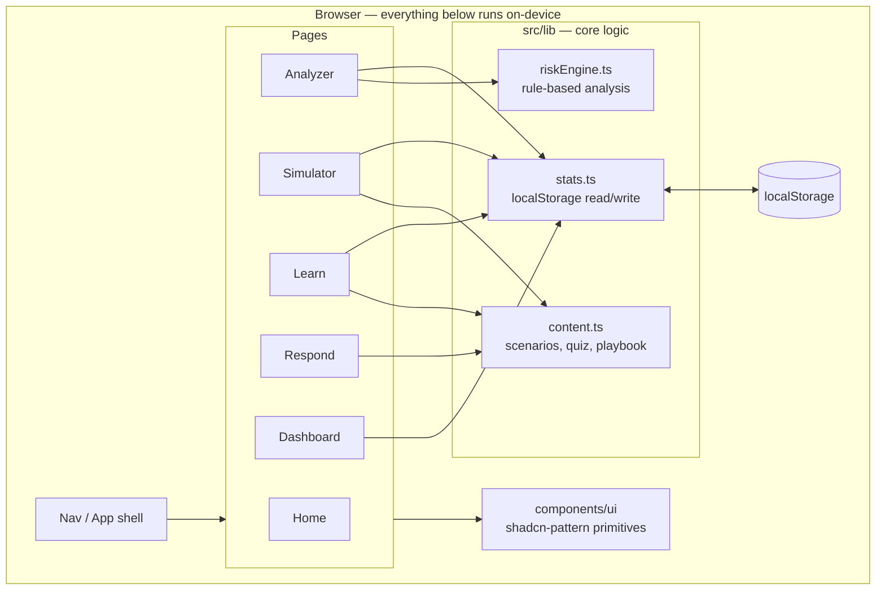
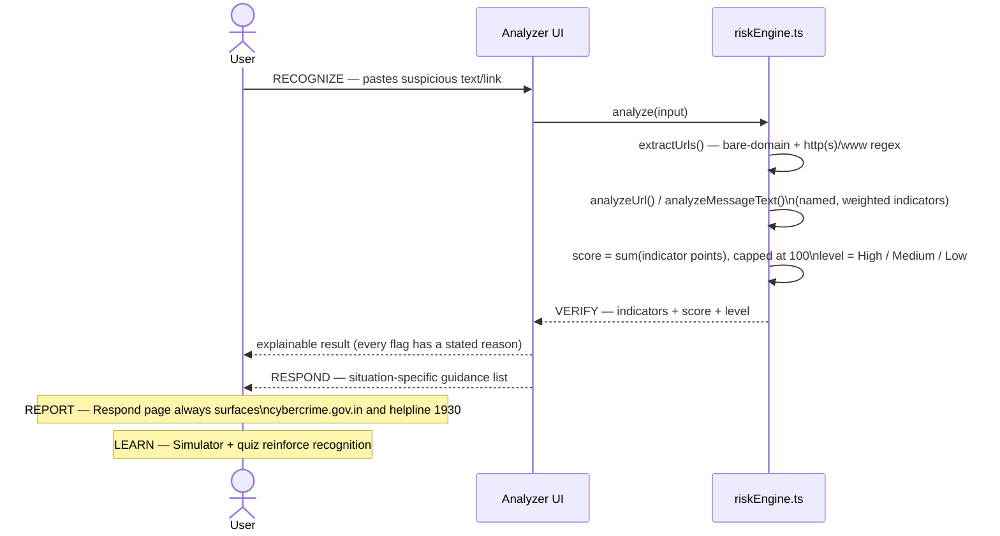

# AegisX — Technical Design Document

## 1. Overview

AegisX is a **client-only** single-page application. For the hackathon MVP there is
deliberately no backend, no database, and no network call required for the app's core
function: a citizen pastes a message or link, and a transparent rule engine — running
entirely in their browser — returns an explainable risk assessment and guidance.

This keeps the prototype low-resource, fast on any device, and privacy-preserving by
construction (nothing typed into the Analyzer ever leaves the device). Section 6 below
describes how this evolves into a networked, production-grade system.

## 2. System context

## 3. Application architecture (current MVP)

## 4. Core data flow — RECOGNIZE → VERIFY → RESPOND → REPORT → LEARN

The hackathon proposal's five-stage flow maps onto the running app like this:

## 5. Module breakdown

| Module | Purpose | Input | Processing | Output |
|---|---|---|---|---|
| **Nav / App shell** (`App.tsx`, `Nav.tsx`) | Page routing without a router dependency | Selected tab id | `useState` page switch, scroll-to-top | Rendered page + accessible current-page nav state |
| **Analyzer** (`pages/Analyzer.tsx`) | Entry point for risk checking | Pasted text/URL | Calls `analyze()`, renders result | Risk banner, meter, indicator list, guidance |
| **Risk Engine** (`lib/riskEngine.ts`) | Rule-based, explainable detection | Raw string | URL extraction → per-URL checks (IP host, HTTPS, `@` trick, punycode, shorteners, risky TLD, subdomain depth, hyphen/brand mismatch, encoded query) + per-message checks (urgency, credential requests, money hooks, remote-access asks, authority impersonation, generic greeting) → weighted scoring | `{ score, level, indicators[], guidance[] }` |
| **Simulator** (`pages/Simulator.tsx`, `lib/content.ts`) | Practice recognising scams in context | Scenario choice | Static scenario data + chosen-option lookup | Correct/incorrect feedback with reasoning |
| **Learn** (`pages/Learn.tsx`, `lib/content.ts`) | Awareness education + self-check | Accordion state, quiz answers | Local answer-vs-key comparison | Explained quiz score |
| **Respond** (`pages/Respond.tsx`, `lib/content.ts`) | Incident response guidance | Situation selection (visual, all shown) | Static playbook lookup | Ordered remediation steps + official reporting channels |
| **Dashboard** (`pages/Dashboard.tsx`, `lib/stats.ts`) | Session-level self-awareness | Read from `localStorage` | Aggregate counts | Stat cards (analyses run, risk-level breakdown, quiz best score) |
| **UI primitives** (`components/ui/*`) | Consistent, accessible presentation | — | Radix UI behaviour + Tailwind styling via `cva`/`cn()` | Button, Card, Badge, Tabs, Progress, Alert, Accordion, Input, Textarea |

## 6. Risk scoring model

Each matched indicator has a **severity** (`low` / `medium` / `high`) and a fixed point
value (`8` / `20` / `50`). Points sum and are capped at 100.

- **High indicators are individually decisive** (score ≥ 45 on their own) — e.g. a direct
  OTP/PIN request, a brand name paired with a look-alike domain, an `@`-trick redirect, a
  request to install a remote-access app. These are patterns with essentially no
  legitimate use in consumer messaging.
- **Medium/low indicators accumulate** — e.g. a URL shortener alone is only cautionary
  (`Medium`), and a single weak signal like a non-HTTPS link or an unusual TLD stays
  `Low` unless it combines with something else.
- **Thresholds:** score ≥ 45 → **High**, score ≥ 18 → **Medium**, else **Low**.

This mirrors the proposal's requirement that the score be an **advisory heuristic**, not
a fraud verdict, while still being strict enough to flag the highest-confidence patterns
on their own. See [`docs/SAMPLE_DATA.md`](./SAMPLE_DATA.md) and
`src/lib/riskEngine.test.ts` for worked examples and their expected classification.

## 7. Security & privacy posture (MVP)

- No accounts, no server, no persistent identifiers — `localStorage` only, scoped to
  session-level counters (never the analyzed text itself).
- No third-party analytics or trackers.
- The only outbound network request the page makes is loading the Atkinson Hyperlegible
  font from Google Fonts; everything else is bundled.
- Because there is no backend in the MVP, there is no server-side attack surface
  (no auth, no DB, no API) to secure yet — see Section 8 for what that adds later.

## 8. Future scalability

| Concern | MVP (now) | Production path |
|---|---|---|
| Detection logic | Client-side rule engine | Same rules as a versioned service (Flask/FastAPI or Node), so logic updates don't require an app release |
| Data | None persisted server-side | PostgreSQL for user accounts/history, if a login is ever introduced |
| Threat intel | Static curated lists in code | Pluggable feed ingestion (domain blocklists, shortener registries) refreshed server-side |
| NLP | Keyword/pattern matching | Optional local or hosted NLP model behind the same `analyze()` interface, for explanation quality, not as the sole verdict |
| Deployment | Static build (any static host/CDN) | Containerised API + CDN-hosted frontend |
| Reach | Single web app | Browser extension, mobile app, multilingual UI |

The `analyze()` function's input/output contract is intentionally simple
(`string in → { score, level, indicators, guidance } out`) so it can be swapped for a
networked implementation later without changing any page component.
