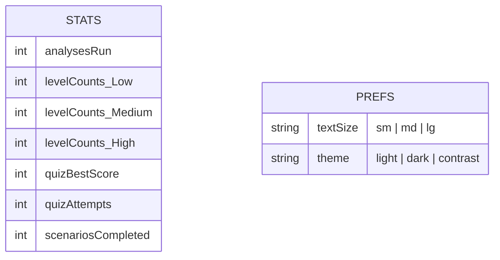
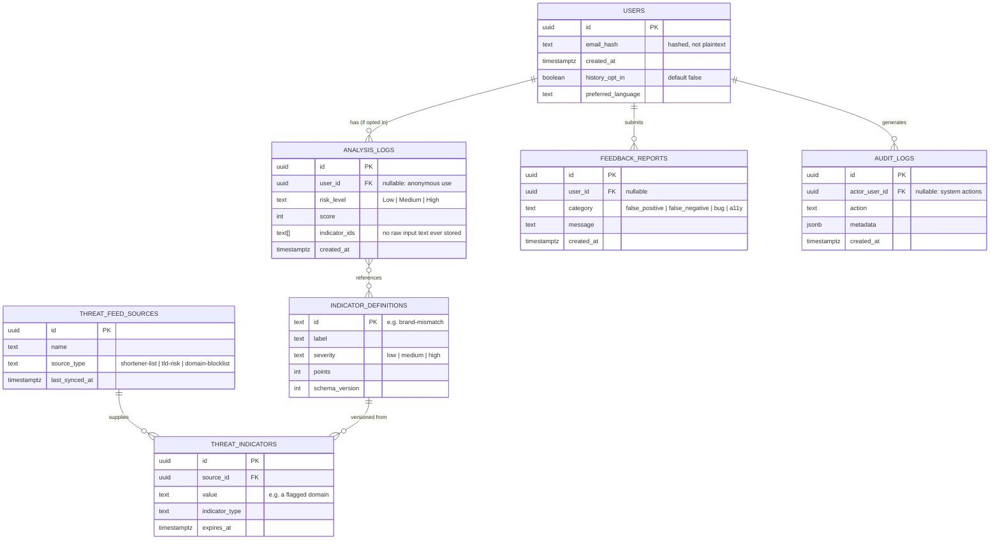

# AegisX — Backend & Data Schema Document

| | |
|---|---|
| **Document type** | Backend / Data Schema Document |
| **Version** | 1.0 |
| **Related documents** | [`ARCHITECTURE.md`](./ARCHITECTURE.md) · [`API_REFERENCE.md`](./API_REFERENCE.md) · [`COMPLIANCE.md`](./COMPLIANCE.md) |

> **Current state, stated plainly:** AegisX has **no backend and no database** in this release — see
> [`ARCHITECTURE.md` Section 1](./ARCHITECTURE.md#1-overview). This is a deliberate MVP decision, not an
> oversight: it removes an entire class of server-side risk and keeps the product privacy-preserving by
> construction. This document covers (1) the **actual client-side data model** that exists today, and
> (2) a **proposed** backend schema for the future phase described in
> [`IMPLEMENTATION_PLAN.md`](./IMPLEMENTATION_PLAN.md) — clearly marked as proposed/not built.

---

## Part A — Current data model (client-side, implemented today)

All state lives in the browser's `localStorage`, under two keys, both validated on every read (untrusted
input handling — see [`SECURITY.md`](../SECURITY.md)).

| Key | Shape | Contains | Never contains |
|---|---|---|---|
| `aegisx:stats:v1` | `Stats` (see `src/lib/stats.ts`) | Anonymous counters only | The analyzed message/URL text, any identifier |
| `aegisx:prefs:v1` | `Prefs` (see `src/lib/prefs.ts`) | Display preferences only | Anything personal |

Both are: capped in size (10KB / 500 bytes respectively), schema-validated field-by-field on load (wrong
types, negative numbers, and unknown keys — including `__proto__`/`constructor` pollution attempts — are
discarded, not trusted), and fully erasable via the Dashboard's "Clear saved data" control. Nothing is
ever transmitted off the device.

## Part B — Proposed future backend schema (NOT implemented — roadmap only)

If AegisX adds optional accounts, cross-device history, or server-aggregated threat intelligence (see
[`ARCHITECTURE.md` Section 9](./ARCHITECTURE.md#9-future-scalability)), this is the proposed relational
model, designed around one hard rule carried over from the current privacy posture:

> **Rule carried forward: the raw analyzed message/URL text is never stored**, even in a future backend —
> only metadata (risk level, indicator IDs, timestamp) would be persisted, and only for a user who has
> opted into history. This preserves the DPDP data-minimisation posture documented in `COMPLIANCE.md`.

### Table notes

| Table | Purpose | Key design decisions |
|---|---|---|
| `USERS` | Optional accounts for cross-device history | `email_hash`, not plaintext email, at rest; `history_opt_in` defaults to `false` — opt-in, not opt-out, consistent with DPDP consent principles |
| `ANALYSIS_LOGS` | Opt-in history of past checks | Stores **only** `risk_level`, `score`, and which named `indicator_ids` fired — never the input text itself |
| `INDICATOR_DEFINITIONS` | Versioned catalogue of rule-engine indicators | Lets the engine's rules evolve server-side without an app redeploy, and lets `ANALYSIS_LOGS` reference a stable ID even as wording/weights change |
| `THREAT_FEED_SOURCES` / `THREAT_INDICATORS` | Pluggable threat-intel ingestion (domain blocklists, shortener registries) | `expires_at` so stale threat data ages out automatically |
| `FEEDBACK_REPORTS` | User-reported false positives/negatives, bugs, accessibility issues | Feeds back into `INDICATOR_DEFINITIONS` tuning |
| `AUDIT_LOGS` | Security/compliance audit trail | Required groundwork if this phase ever triggers a CERT-In reporting obligation — see `SECURITY.md` |

### Indexing & retention (proposed)

- `ANALYSIS_LOGS(user_id, created_at)` — composite index for a user's history view.
- `THREAT_INDICATORS(value)` — indexed for O(1)-ish lookup during analysis.
- Retention: `ANALYSIS_LOGS` and `AUDIT_LOGS` would need an explicit, documented retention period before
  launch (a concrete number is a product/legal decision, not a technical one — flagged here, not assumed).

### What this phase would require before it could be built

1. A DPDP Act/Rules compliance review (consent notice design, breach-reporting process, retention policy)
   — see [`COMPLIANCE.md`](./COMPLIANCE.md).
2. A chosen backend runtime (Section 9 of `ARCHITECTURE.md` suggests Flask/FastAPI or Node, with
   PostgreSQL).
3. Updated `vercel.json`/hosting plan, since this would move AegisX off a pure-static architecture onto
   one with real server-side compute and a database — i.e., out of the free Hobby-tier static model this
   release relies on.

None of the above is scheduled for the current release; it is documented here specifically so that if and
when this phase starts, the data model doesn't have to be designed from scratch, and the privacy
guarantees already established aren't accidentally lost in translation.
