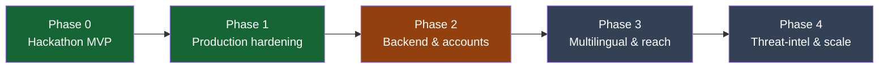
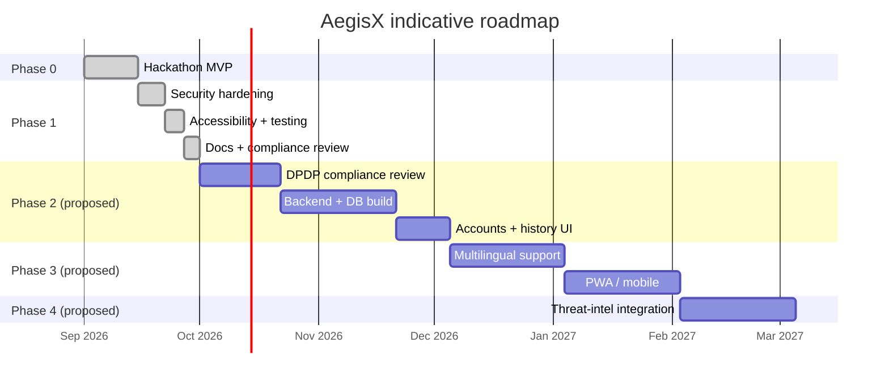

# AegisX — Implementation Plan

| | |
|---|---|
| **Document type** | Implementation Plan |
| **Version** | 1.0 |
| **Related documents** | [`PRD.md`](./PRD.md) · [`TRD.md`](./TRD.md) · [`RISK_REGISTER.md`](./RISK_REGISTER.md) |

---

## 1. Delivery phases

**Legend:** green = complete (this submission), amber = designed but not built, grey = future/roadmap.

## 2. Phase 0 — Hackathon MVP ✅ complete

| Workstream | Deliverables |
|---|---|
| Core product | Analyzer (rule-based risk engine), Scenario Simulator, Learn + quiz, Respond playbook, Dashboard |
| Design | Navy/blue accessible design system, Atkinson Hyperlegible typography, shadcn/ui-pattern components |
| Docs | `README.md`, initial `ARCHITECTURE.md`, `LICENSE` |

## 3. Phase 1 — Production hardening ✅ complete

| Workstream | Deliverables |
|---|---|
| Security | CSP + full security headers (`vercel.json`), input caps, untrusted-storage validation, source-level XSS/network-call scans |
| Accessibility | Text-size + theme toolbar, high-contrast theme, focus management, axe-core automated testing (0 violations) |
| Routing & policy pages | Real per-page URLs, Privacy/Terms/Accessibility/Disclaimer/Contact/Sitemap |
| Testing | Unit + accessibility tests (Vitest/jsdom), real-HTTP server tests, real-browser CSP/XSS/functional tests (Puppeteer) |
| CI/CD | GitHub Actions pipeline, Dependabot, `npm run check` |
| Deployment | `vercel.json`, `DEPLOY_VERCEL.md` free-tier guide |
| Governance docs | `SECURITY.md`, `COMPLIANCE.md` (GIGW 3.0 / DPDP / CERT-In self-assessment) |
| Full documentation suite | This set of documents (PRD, TRD, App Flow, UI/UX, Backend Schema, API Reference, Test Plan, Risk Register) |

## 4. Phase 2 — Backend & accounts (proposed, not built)

| Workstream | Scope |
|---|---|
| Compliance review | DPDP consent-notice design, retention policy, breach-reporting process (prerequisite — see `COMPLIANCE.md`) |
| Backend | Flask/FastAPI or Node service implementing the same `analyze()` contract (see `API_REFERENCE.md`) behind a real endpoint |
| Database | PostgreSQL, schema per `BACKEND_SCHEMA.md` Part B |
| Accounts | Optional, opt-in; no raw analyzed text ever persisted |
| Hosting | Move off pure-static hosting to a platform supporting server compute + DB |

## 5. Phase 3 — Multilingual & reach (proposed)

- Hindi + regional-language UI and risk-engine phrase lists (today: English/romanised only)
- Native mobile app or installable PWA
- Browser extension for inline link checking

## 6. Phase 4 — Threat-intel & scale (proposed)

- Pluggable threat-feed ingestion (`THREAT_FEED_SOURCES` / `THREAT_INDICATORS`, see `BACKEND_SCHEMA.md`)
- Optional local/hosted NLP model for explanation quality (never as the sole verdict — explainability
  stays rule-based per `PRD.md` TR-05)
- Institutional dashboards for schools/businesses

## 7. Indicative timeline (illustrative, not resourced against a real team calendar)

## 8. Roles needed per phase

*(Role-based planning — no real individuals are named; a hackathon team maps multiple roles to one person.)*

| Role | Responsible for |
|---|---|
| Frontend/Product Engineer | Feature implementation, component library, UI |
| Security Reviewer | Threat modelling, header/CSP configuration, dependency audits |
| Accessibility Specialist | WCAG conformance, screen-reader testing (not yet done — see `COMPLIANCE.md`) |
| Backend Engineer (Phase 2+) | API + database implementation |
| Compliance/Legal Reviewer (Phase 2+) | DPDP review before any personal data collection begins |
| QA Engineer | Test strategy execution — see `TEST_PLAN.md` |

## 9. Definition of done (per phase)

A phase is done when every requirement it claims in `PRD.md`/`TRD.md` has a passing automated test where
one is feasible, the relevant section of `COMPLIANCE.md` is updated to match reality, and `npm run check`
is green. See [`RISK_REGISTER.md`](./RISK_REGISTER.md) for what could block a phase and how it's mitigated.
