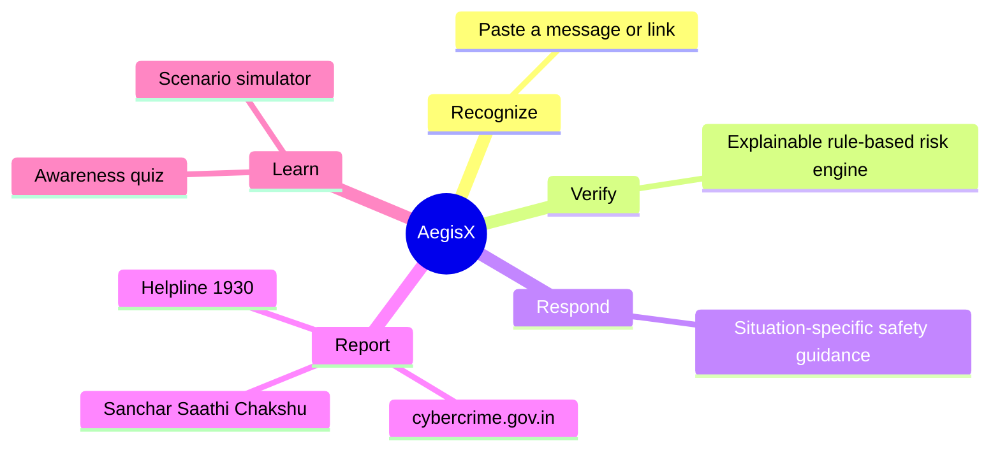
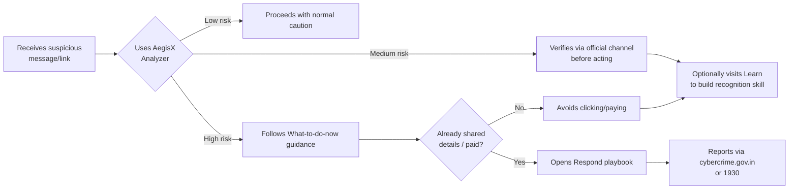

# AegisX — Product Requirements Document (PRD)

| | |
|---|---|
| **Document type** | Product Requirements Document |
| **Product** | AegisX — Digital Safety & Cyber Fraud Awareness Platform |
| **Version** | 1.0 |
| **Status** | Approved for hackathon submission build |
| **Owner** | Team AegisX |
| **Related documents** | [`TRD.md`](./TRD.md) · [`APP_FLOW.md`](./APP_FLOW.md) · [`UI_UX.md`](./UI_UX.md) · [`ARCHITECTURE.md`](./ARCHITECTURE.md) |

---

## Table of contents

1. [Executive summary](#1-executive-summary)
2. [Problem statement](#2-problem-statement)
3. [Goals and success metrics](#3-goals-and-success-metrics)
4. [Scope](#4-scope)
5. [User personas](#5-user-personas)
6. [User journeys / use cases](#6-user-journeys--use-cases)
7. [Functional requirements](#7-functional-requirements)
8. [Non-functional requirements](#8-non-functional-requirements)
9. [Assumptions, constraints, dependencies](#9-assumptions-constraints-dependencies)
10. [Release criteria](#10-release-criteria)
11. [Out of scope / future considerations](#11-out-of-scope--future-considerations)
12. [Glossary](#12-glossary)

---

## 1. Executive summary

AegisX is a citizen-facing digital-safety web application built for the **My Bharat Hackathon**, theme
*Digital Safety and Cyber Fraud Awareness*. It gives any citizen a fast, explainable way to check whether
a message, link, or request they've received shows signs of fraud, and tells them exactly what to do
next — including when and how to use India's official reporting channels. It does this entirely in the
user's browser, collecting no personal data.

## 2. Problem statement

India's rapid growth in digital payments and online services has made phishing, impersonation, fake
customer-support scams, and malicious links a routine part of citizens' SMS, WhatsApp, and call traffic.
The people most exposed are often the least equipped to evaluate a message in the moment: first-time
digital-payment users, senior citizens, students, and small businesses managing transactions without
institutional IT support.

The gap isn't a lack of awareness content in the abstract — it's the absence of a **fast, situational
check** at the exact moment someone is deciding whether to click, call, or pay. Generic safety tips don't
explain why *this specific message* is risky, and people who do suspect fraud often don't know the
concrete next step, so the critical early-response window is frequently missed.

## 3. Goals and success metrics

| Goal | How AegisX addresses it | Indicative success signal |
|---|---|---|
| Reduce successful fraud attempts | Real-time, explainable risk check before the user acts | Risk level correctly classifies known scam patterns (validated by the automated test suite against labeled samples) |
| Build durable recognition skill, not just one-off warnings | Scenario Simulator + quiz reinforce patterns, not just this one message | Quiz completion and scenario-engagement counts (Dashboard) |
| Close the "what do I do now" gap | Respond playbook gives ordered, situation-specific steps | Every high-risk result links directly to the matching playbook step |
| Increase use of official reporting channels | cybercrime.gov.in / 1930 / Chakshu surfaced at every relevant point, not just once | Channels appear on the Home, Analyzer (high-risk result), Respond, and Contact pages |
| Be usable by the least digitally confident citizens | Plain language, large touch targets, WCAG 2.1 AA target, text-size/contrast controls | Zero automated accessibility violations (`npm test`) |
| Be trustworthy about its own limits | Explicit "what AegisX is/isn't" messaging everywhere | No wording implies certainty or government affiliation (verified in Disclaimer/Home copy) |

This is a hackathon-scale project: metrics above describe *what the product is designed to achieve* and
*what is currently testable*, not measured real-world outcome data, which would require a live deployment
with real users.

## 4. Scope

### In scope (current release)

- Rule-based Analyzer for messages and URLs, with explainable indicators and a risk level
- Scam Scenario Simulator (4 scenarios)
- Learn module: awareness content + 5-question quiz
- Respond module: incident-response playbook + official reporting channel integration
- On-device Dashboard with session stats and a data-clearing control
- Full policy-page set (Privacy, Terms, Accessibility Statement, Disclaimer, Contact, Sitemap)
- Accessibility toolbar (text size, light/dark/high-contrast themes)
- Production security hardening and deployment tooling

### Out of scope (current release)

- User accounts, login, or any server-side storage
- Real-time threat-intelligence feeds or machine-learning-based detection
- Multilingual UI (English only today)
- Native mobile apps or browser extensions
- Integration with any bank, telecom, or government system's internal APIs

## 5. User personas

| Persona | Context | Primary need |
|---|---|---|
| **First-time UPI user** | Recently started using digital payments; limited exposure to scam patterns | A fast, jargon-free check before tapping a payment link |
| **Senior citizen** | May receive "bank security" or "KYC update" calls/SMS | Large text, high contrast, plain-language guidance, clear next steps |
| **Student** | Heavy WhatsApp/SMS user; targeted by fake job-offer and prize scams | Quick verification habit-building via the Simulator and quiz |
| **Small-business owner** | Handles customer payments and supplier communication without dedicated IT/security staff | Practical incident response steps if something's already gone wrong |
| **Concerned family member** | Wants to teach a relative to recognise scams | Shareable, explainable results and a learning module to walk through together |

## 6. User journeys / use cases

| ID | Use case | Primary actor | Trigger | Outcome |
|---|---|---|---|---|
| UC-01 | Check a suspicious message | Any user | Receives an SMS/WhatsApp/email they're unsure about | Gets a Low/Medium/High result with named reasons and guidance |
| UC-02 | Check a suspicious link | Any user | About to click an unfamiliar link | Same as UC-01, URL-specific indicators |
| UC-03 | Practice recognising a scam | Any user | Wants to build a habit before a real incident | Completes a Simulator scenario with explained feedback |
| UC-04 | Learn core concepts and self-test | Any user | Wants structured awareness education | Reads awareness cards, completes the quiz, sees a score |
| UC-05 | Respond to an active incident | A user who already clicked/paid/shared details | Realises they've been scammed | Finds the matching playbook and official reporting links |
| UC-06 | Review personal safety activity | Returning user | Wants to see their own usage | Views Dashboard stats; can clear all local data |
| UC-07 | Adjust for accessibility needs | User with low vision or reading difficulty | Needs larger text or higher contrast | Uses the toolbar; preference persists across visits |

## 7. Functional requirements

| ID | Requirement | Priority | Verified by |
|---|---|---|---|
| FR-01 | The system shall accept free-text or URL input via the Analyzer and return a risk level of Low, Medium, or High | Must | `riskEngine.test.ts` |
| FR-02 | Every non-Low result shall include at least one named indicator with a plain-language explanation | Must | `riskEngine.test.ts` ("explainability") |
| FR-03 | The system shall never claim certainty that input is or isn't fraudulent | Must | Copy review (Home, Analyzer) |
| FR-04 | The system shall provide at least 4 realistic scam scenarios with multiple response options and explained feedback | Must | `content.test.ts` |
| FR-05 | The system shall provide an awareness quiz of at least 5 questions with explained answers | Must | `content.test.ts` |
| FR-06 | The system shall provide an incident-response playbook covering at least: clicked a link, shared an OTP, made a payment, installed a remote-access app | Must | `content.test.ts` |
| FR-07 | The system shall link to cybercrime.gov.in and the 1930 helpline from the Analyzer's high-risk result, the Respond page, and the Contact page | Must | `content.test.ts`, browser check |
| FR-08 | The system shall persist only anonymous session counters and display preferences locally, never the analyzed text | Must | `stats.test.ts` |
| FR-09 | The user shall be able to clear all locally stored data with one action | Must | `browser-check.mjs` |
| FR-10 | The system shall provide a Privacy Policy, Terms of Use, Accessibility Statement, Disclaimer, Contact page, and Sitemap | Must | Route presence tests |
| FR-11 | The user shall be able to change text size (3 levels) and colour theme (light/dark/high-contrast) | Should | `browser-check.mjs` |
| FR-12 | Unknown URLs shall show a clear "page not found" state without being indexed by search engines | Should | `routes.test.ts` |

## 8. Non-functional requirements

| ID | Category | Requirement | Target / verification |
|---|---|---|---|
| NFR-01 | Accessibility | WCAG 2.1 Level AA | 0 axe-core violations across all routes/themes (`App.a11y.test.tsx`) |
| NFR-02 | Privacy | No personal data collection | Enforced by design (no backend); documented in `docs/COMPLIANCE.md` |
| NFR-03 | Security | No inline-script/eval XSS vectors; strict transport security | `security.test.ts`, `vercel.json`, `SECURITY.md` |
| NFR-04 | Performance | Analyzer returns a result in well under 1 second for realistic input | `riskEngine.hardening.test.ts` (<750 ms even on adversarial input) |
| NFR-05 | Reliability | A rendering error must not blank the whole page | `ErrorBoundary` component |
| NFR-06 | Portability | Runs on any evergreen browser, any screen size, no install | Responsive Tailwind layout; manual + automated checks |
| NFR-07 | Maintainability | Core logic covered by automated tests before being trusted | 100+ automated checks across three layers (unit, server, browser) — see `TEST_PLAN.md` |
| NFR-08 | Cost | Deployable at zero hosting cost | Static build fits Vercel's free Hobby tier — see `DEPLOY_VERCEL.md` |

## 9. Assumptions, constraints, dependencies

- **Assumption:** users primarily interact in English; romanised/English-language scam text is the most
  common pattern this release targets.
- **Constraint:** no backend budget or infrastructure for this release — all logic must run client-side.
- **Constraint:** must not imply government affiliation or use official emblems.
- **Dependency:** India's official reporting channels (cybercrime.gov.in, 1930, Sanchar Saathi) remain the
  correct channels to link to; if these change, Respond/Contact content needs updating.

## 10. Release criteria

A release is considered ready when:

1. `npm run check` passes completely (lint, unit+accessibility tests, build, server security tests,
   real-browser security/functional check, dependency audit).
2. Every functional requirement above marked **Must** is implemented and covered by an automated test.
3. `docs/COMPLIANCE.md` accurately reflects the current state (no claim exceeds what's implemented).
4. No known High/Critical vulnerability in production dependencies (`npm audit --omit=dev`).

## 11. Out of scope / future considerations

See [`ARCHITECTURE.md` Section 9](./ARCHITECTURE.md#9-future-scalability) and
[`IMPLEMENTATION_PLAN.md`](./IMPLEMENTATION_PLAN.md) for the phased roadmap: accounts/history, a real
backend and threat-intel feeds, multilingual support, a browser extension, and a mobile app.

## 12. Glossary

| Term | Meaning |
|---|---|
| **Indicator** | A single named, explainable signal the risk engine detected (e.g., "URL shortener used") |
| **Risk level** | The overall Low/Medium/High classification derived from matched indicators |
| **Advisory result** | A result that informs but does not prove fraud — AegisX's stated limitation |
| **Chakshu** | DoT's Sanchar Saathi facility for reporting suspected fraud communications (not for cases with financial loss) |
| **GIGW 3.0** | Guidelines for Indian Government Websites and Apps, version 3.0 |
