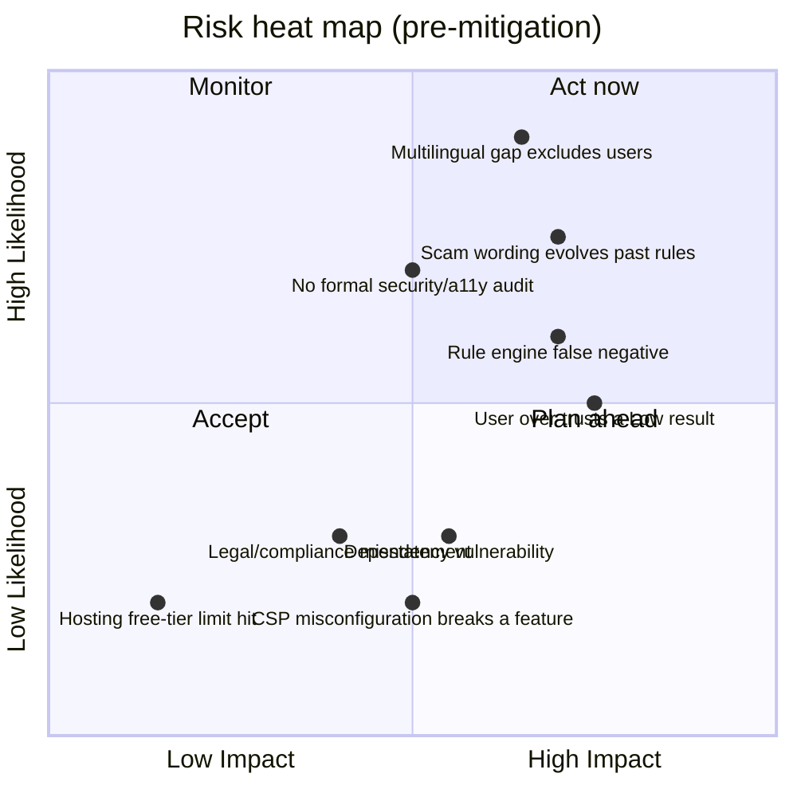

# AegisX — Risk Register

| | |
|---|---|
| **Document type** | Risk Register |
| **Version** | 1.0 |
| **Related documents** | [`SECURITY.md`](../SECURITY.md) · [`COMPLIANCE.md`](./COMPLIANCE.md) · [`IMPLEMENTATION_PLAN.md`](./IMPLEMENTATION_PLAN.md) |

Risk scored as **Likelihood × Impact**, each rated Low/Medium/High. "Residual" reflects risk level after
the stated mitigation. This is a living document — update it when a mitigation changes or a new risk is
identified, not just at submission time.

## Product & content risks

| ID | Risk | Likelihood | Impact | Mitigation | Residual |
|---|---|---|---|---|---|
| R-01 | Risk engine produces a **false negative** (misses a real scam) | High | High | Explainable, testable rule set; labeled sample suite in `SAMPLE_DATA.md`; explicit "advisory, not proof" messaging everywhere so users don't over-rely on a Low result | Medium |
| R-02 | Risk engine produces a **false positive** (flags something legitimate) | Medium | Medium | Negative-control test cases (s7, s8 in `SAMPLE_DATA.md`); guidance text says "verify," never "this is definitely fraud" | Medium |
| R-03 | User treats a Low result as a guarantee of safety | Medium | High | Explicit copy on Home and every result: "no strong red flags found" rather than "safe"; FR-03 in `PRD.md` | Medium |
| R-04 | Scam wording evolves faster than the static phrase lists | High | High | Documented limitation (`README.md`, in-app copy); `INDICATOR_DEFINITIONS` versioning designed into the Phase 2 schema (`BACKEND_SCHEMA.md`) for easier updates without a full redeploy, once built | High (until Phase 2) |
| R-05 | English-only UI excludes non-English-literate users — arguably the highest-impact accessibility gap given the target personas | High | High | Explicitly flagged in `COMPLIANCE.md` and `PRD.md` as the clearest current gap; multilingual support is Phase 3 in `IMPLEMENTATION_PLAN.md`, not silently deferred | High (until Phase 3) |

## Security risks

| ID | Risk | Likelihood | Impact | Mitigation | Residual |
|---|---|---|---|---|---|
| R-06 | XSS via pasted content | Low | High | No `dangerouslySetInnerHTML`/`innerHTML`; React's default escaping; verified against a real payload in a real browser (`test:browser`) | Low |
| R-07 | CSP misconfiguration silently breaks a feature or silently fails to apply | Medium | Medium | `security.test.ts` asserts the config programmatically; `test:browser` asserts zero violations against the real build | Low |
| R-08 | Known-vulnerable dependency ships to production | Medium | Medium | `npm audit --omit=dev --audit-level=high` gate in CI; Dependabot weekly PRs | Low |
| R-09 | Tampered `localStorage` (shared device, malicious extension) causes unexpected behaviour | Medium | Low | Full validation/sanitisation of every stored field, including prototype-pollution resistance (`stats.test.ts`, `prefs.test.ts`) | Low |
| R-10 | No independent penetration test or CERT-In/STQC-empanelled audit has been performed | High (as a fact, not a prediction) | Medium | Stated openly in `SECURITY.md`/`COMPLIANCE.md` rather than implied otherwise; scope and disclosure process defined for when issues are found | Medium |

## Compliance & legal risks

| ID | Risk | Likelihood | Impact | Mitigation | Residual |
|---|---|---|---|---|---|
| R-11 | Project is mistaken for an official government service | Low | High | No State Emblem/government branding used anywhere; explicit independence statement on Home, Disclaimer, and Footer on every page | Low |
| R-12 | A future accounts/history feature is built without a DPDP compliance review | Low (not currently planned without review) | High | `BACKEND_SCHEMA.md` and `IMPLEMENTATION_PLAN.md` both explicitly gate Phase 2 on a compliance review before build starts | Low |
| R-13 | This documentation set is read as a legal certification rather than a self-assessment | Medium | Medium | Every compliance claim in `COMPLIANCE.md` is phrased as "self-assessment, not legal advice," with an explicit list of what's *not* done | Low |
| R-14 | CERT-In 6-hour incident-reporting obligation applies but isn't acted on | Low–Medium (legal applicability undetermined) | Medium | `SECURITY.md` documents the requirement and recommends treating a confirmed incident as reportable regardless of the underlying legal determination | Medium |

## Operational risks

| ID | Risk | Likelihood | Impact | Mitigation | Residual |
|---|---|---|---|---|---|
| R-15 | Vercel Hobby (free) plan limits are exceeded | Low | Low | Static-only site with minimal bandwidth needs; documented upgrade path to Pro in `DEPLOY_VERCEL.md` | Low |
| R-16 | A deploy ships a regression that passed CI but fails in practice | Low | Medium | Three independent test layers (see `TEST_PLAN.md`); Vercel's one-click rollback to a previous deployment | Low |
| R-17 | Single point of knowledge (no team redundancy) | Medium | Medium | Comprehensive documentation suite (this set) specifically so the project is not dependent on one person's memory | Low |
