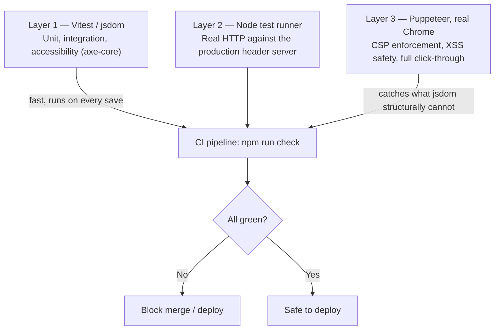

# AegisX — Test Plan

| | |
|---|---|
| **Document type** | Test Strategy / QA Plan |
| **Version** | 1.0 |
| **Related documents** | [`SAMPLE_DATA.md`](./SAMPLE_DATA.md) · [`TRD.md`](./TRD.md) · [`SECURITY.md`](../SECURITY.md) |

---

## 1. Testing philosophy

Each class of bug needs a test environment capable of exposing it. AegisX uses **three distinct layers**
specifically because no single layer catches everything — most notably, a Content-Security-Policy
violation is invisible to jsdom-based unit tests and can only be caught by a real browser engine.



## 2. Test layers in detail

### Layer 1 — Vitest (jsdom), 77 tests across 8 files

| File | Covers |
|---|---|
| `riskEngine.test.ts` | Classification correctness against every labeled sample in `SAMPLE_DATA.md`; explainability; score capping; URL extraction; false-positive avoidance |
| `riskEngine.hardening.test.ts` | Input-length/link-count caps; fuzz testing (hundreds of random Unicode/control-character strings); ReDoS-shaped pathological input (<750ms each) |
| `stats.test.ts` | Untrusted-storage validation: malformed JSON, wrong types, negative/NaN values, oversized payloads, prototype-pollution payloads |
| `prefs.test.ts` | Same class of validation for theme/text-size preferences |
| `routes.test.ts` | Every path maps to the right page; trailing slashes, unknown paths, encoded path tricks handled safely; unique page titles |
| `content.test.ts` | Every scenario has exactly one correct option; every quiz question has a valid answer + explanation; the response playbook references official channels |
| `security.test.ts` | Parses `vercel.json` and asserts every required header and CSP directive is present and strict; scans `index.html` and all of `src/` for inline scripts/styles, dangerous DOM sinks, and any network-call API |
| `App.a11y.test.tsx` | axe-core run against every route, in all 3 themes and at large text size — **0 violations required**; structural checks (exactly one `<h1>` per page, focus moves to it on navigation) |

### Layer 2 — Node test runner, real HTTP, 6 tests

`scripts/serve-secure.test.mjs` starts the actual local header server (`scripts/serve-secure.mjs`, which
replays `vercel.json`'s rules) and makes real HTTP requests:

- Every header from `SECURITY.md` is present on `/`
- SPA rewrite serves `index.html` for unknown client routes, headers intact
- Fingerprinted assets are cached `immutable`
- Literal `../` and `%2f`-encoded path-traversal attempts cannot read files outside `dist/`
- A malformed request path (`/%`) returns 400/404, not a crash

### Layer 3 — Puppeteer, real Chrome, 24 checks

`scripts/browser-check.mjs` is the layer that exists specifically because **jsdom does not enforce CSP**.
It loads the real production build through the real headers in an actual browser and confirms:

- **Zero CSP violations** across every route (via the native `securitypolicyviolation` event, not just
  console-text pattern matching)
- A pasted `` payload never executes, is never parsed as HTML anywhere in the DOM,
  and is retained only as an inert form value
- The Radix-driven progress bar's inline `transform` style still renders correctly under a CSP with no
  `unsafe-inline` in `style-src` (confirms React's CSSOM-based style assignment isn't blocked)
- Full click-through: Analyzer (scam example → High-risk result), Simulator (choose → feedback),
  Learn (answer all → submit → score), Dashboard (shows data → Clear → confirmed zeroed after reload),
  accessibility toolbar (theme/text-size actually mutate the DOM)
- Every `target="_blank"` link has `rel="noopener noreferrer"`; no broken internal links anywhere in the app

## 3. Test data

See [`SAMPLE_DATA.md`](./SAMPLE_DATA.md) for the canonical labeled set (`src/lib/__fixtures__/sampleData.ts`)
shared between documentation and `riskEngine.test.ts` — the same file is the source of truth for both, so
the docs cannot drift from what's actually tested.

## 4. What is explicitly NOT covered (known gaps)

Stated plainly, consistent with `COMPLIANCE.md`'s approach of not overclaiming:

| Gap | Why it's open |
|---|---|
| Manual screen-reader testing (NVDA/JAWS/TalkBack/VoiceOver) | Automated axe-core coverage exists; manual AT testing has not been performed |
| Third-party penetration test | Out of scope/budget for a hackathon submission; see `SECURITY.md` |
| Load/performance testing under concurrent traffic | Not applicable to a static, serverless site in the same way as a backend service |
| Cross-browser visual regression testing | Covered functionally via Chrome-based Puppeteer checks; not run against Firefox/Safari engines |
| Formal STQC/CERT-In certification audit | Requires an external empanelled auditor — see `COMPLIANCE.md` |

## 5. How to run everything

```bash
npm run check
```

Runs, in order: `lint` → `test` (Layer 1) → `build` → `test:server` (Layer 2) → `test:browser` (Layer 3)
→ `audit:prod`. This is exactly what `.github/workflows/ci.yml` runs on every push and pull request.

## 6. Exit criteria for "bug-free, all functions working" sign-off

1. `npm run check` exits `0` from a clean `npm ci` install.
2. Zero axe-core violations (Layer 1).
3. Zero CSP violations and zero uncaught page errors in a real browser (Layer 3).
4. Zero High/Critical vulnerabilities in production dependencies (`npm audit --omit=dev`).
5. Every functional requirement marked **Must** in `PRD.md` has at least one passing automated test
   mapped to it in the traceability table in `TRD.md`.
