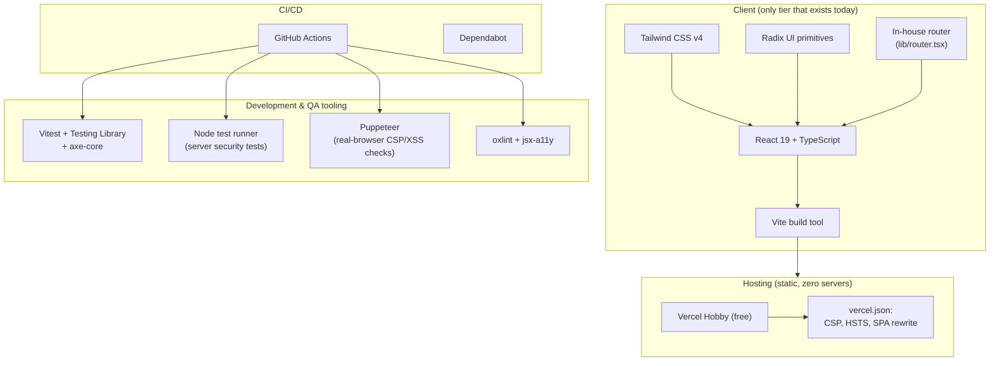

# AegisX — Technical Requirements Document (TRD)

| | |
|---|---|
| **Document type** | Technical Requirements Document |
| **Version** | 1.0 |
| **Status** | Approved |
| **Owner** | Team AegisX |
| **Related documents** | [`PRD.md`](./PRD.md) · [`ARCHITECTURE.md`](./ARCHITECTURE.md) · [`BACKEND_SCHEMA.md`](./BACKEND_SCHEMA.md) · [`TEST_PLAN.md`](./TEST_PLAN.md) |

This document specifies **how** AegisX is built to satisfy the requirements in [`PRD.md`](./PRD.md). For
the narrative system design, see [`ARCHITECTURE.md`](./ARCHITECTURE.md); this document focuses on
concrete technical requirements, traceable to the PRD, with measurable acceptance criteria.

---

## 1. Technology stack

| Layer | Choice | Rationale |
|---|---|---|
| UI framework | React 19 + TypeScript | Component model fits a multi-page, stateful app; TypeScript catches contract errors between the risk engine and UI at compile time |
| Build tool | Vite | Fast dev server, small/optimised production bundles, first-class TS/JSX support |
| Styling | Tailwind CSS v4 | Utility-first styling keeps the design system (tokens in `index.css`) centralised and themeable (light/dark/contrast) without a CSS-in-JS runtime |
| Component patterns | Hand-built shadcn/ui-pattern components on Radix UI primitives | Radix supplies tested accessibility behaviour (focus management, ARIA) for Accordion/Progress; `cva`+`cn()` give consistent, typed variant styling |
| Routing | In-house (`lib/router.tsx`) | Real per-page URLs (needed for GIGW-style policy pages and deep-linking) without pulling in a full routing library for ~12 static routes |
| Testing | Vitest, Testing Library, axe-core, Node's test runner, Puppeteer | Each targets a distinct risk class — see [`TEST_PLAN.md`](./TEST_PLAN.md) |
| Hosting | Vercel (Hobby/free tier) | Zero-cost static hosting with automatic HTTPS, global CDN, and config-as-code headers (`vercel.json`) — see [`DEPLOY_VERCEL.md`](./DEPLOY_VERCEL.md) |

## 2. Technical requirements by category

### 2.1 Frontend

| ID | Requirement | Acceptance criteria |
|---|---|---|
| TR-01 | Single-page app with real, bookmarkable URLs per section | Direct load of any route (e.g. `/analyze`) renders the correct page, verified by `browser-check.mjs` |
| TR-02 | No build-time or runtime dependency on a backend | `grep` for `fetch`/`XMLHttpRequest`/`WebSocket` across `src/` returns none (`security.test.ts`) |
| TR-03 | Responsive layout, mobile-first | Verified by manual viewport testing + Tailwind responsive utilities |
| TR-04 | Theming: light, dark, high-contrast | CSS custom properties per theme in `index.css`; toggled via `data-theme` attribute |

### 2.2 Risk engine

| ID | Requirement | Acceptance criteria |
|---|---|---|
| TR-05 | Deterministic, explainable scoring (no opaque ML model) | Every output indicator maps 1:1 to a named rule in `riskEngine.ts` |
| TR-06 | Bounded execution time regardless of input | Input capped at `MAX_INPUT_CHARS`; at most `MAX_URLS_ANALYZED` links parsed per call; fuzz + ReDoS-shaped tests complete in <750ms (`riskEngine.hardening.test.ts`) |
| TR-07 | Pure function contract: `string in → structured result out` | No side effects inside `analyze()`; enables future reuse behind a real API with no logic change — see [`API_REFERENCE.md`](./API_REFERENCE.md) |

### 2.3 Accessibility

| ID | Requirement | Acceptance criteria |
|---|---|---|
| TR-08 | WCAG 2.1 AA conformance target | 0 axe-core violations, all routes × all 3 themes (`App.a11y.test.tsx`) |
| TR-09 | Full keyboard operability | Skip link, visible focus ring, Radix-managed focus for Accordion; focus moves to the new page's `<h1>` on navigation |
| TR-10 | Respect reduced-motion preference | `prefers-reduced-motion` media query collapses all transitions/animations |

### 2.4 Security

| ID | Requirement | Acceptance criteria |
|---|---|---|
| TR-11 | Strict Content-Security-Policy, no `unsafe-inline`/`unsafe-eval` in `script-src` | `security.test.ts` parses `vercel.json` and asserts this |
| TR-12 | HSTS, X-Frame-Options, X-Content-Type-Options, Referrer-Policy, Permissions-Policy set on every response | Same, plus live verification via `scripts/serve-secure.test.mjs` |
| TR-13 | No `dangerouslySetInnerHTML`/`innerHTML`/`eval` in application code | Source-scan test (`security.test.ts`) |
| TR-14 | All `localStorage` reads treated as untrusted input | Type/range validation in `stats.ts`/`prefs.ts`; prototype-pollution regression test |
| TR-15 | A pasted script-like payload must never execute | Verified in a real browser, not just jsdom (`browser-check.mjs`) |

### 2.5 Testing & CI

| ID | Requirement | Acceptance criteria |
|---|---|---|
| TR-16 | Every push/PR runs the full check pipeline | `.github/workflows/ci.yml`: lint → unit/a11y tests → build → server tests → browser tests → audit |
| TR-17 | Dependencies kept current | Dependabot weekly PRs for npm + GitHub Actions |
| TR-18 | No known High/Critical vulnerability in production dependencies | `npm audit --omit=dev --audit-level=high` gate in CI |

### 2.6 Hosting & operations

| ID | Requirement | Acceptance criteria |
|---|---|---|
| TR-19 | Zero-cost hosting for a hackathon-scale demo | Fits Vercel Hobby plan limits (static, no functions) |
| TR-20 | Config-as-code deployment (no manual dashboard clicking required for headers/build settings) | `vercel.json` defines build command, output dir, headers, rewrites |
| TR-21 | Local parity with production serving behaviour | `npm run preview:secure` replays the exact `vercel.json` rules locally |

## 3. Environments

AegisX has a single deployable artifact (`dist/`, a static bundle) and no server-side environment
configuration, so there is one logical environment plus local development:

| Environment | Purpose | How it's produced |
|---|---|---|
| **Local development** | Fast iteration, hot reload | `npm run dev` (Vite dev server, unminified, source maps) |
| **CI** | Automated verification on every push/PR | GitHub Actions runs the full `npm run check` pipeline |
| **Production** | What the public URL serves | `npm run build` → static `dist/` → deployed to Vercel, headers from `vercel.json` |

No staging environment exists today because there is no server-side state to stage; Vercel's automatic
PR preview deployments serve this purpose for reviewing UI changes before merge.

## 4. Browser/device support

| Dimension | Target |
|---|---|
| Browsers | Current and previous major version of Chrome, Edge, Firefox, Safari (desktop + mobile) |
| Screen sizes | 320px width (small mobile) up to large desktop, fluid in between |
| JavaScript requirement | Required (a `<noscript>` fallback message points to cybercrime.gov.in/1930 for non-JS users) |
| Assistive technology | Compatible with screen readers via standard ARIA/semantic HTML (automated axe-core coverage; manual screen-reader testing not yet performed — see `COMPLIANCE.md`) |

## 5. Third-party dependency policy

- Production dependencies are kept minimal and auditable: React, Radix primitives, `class-variance-authority`,
  `clsx`, `tailwind-merge`, `lucide-react`, `@fontsource/atkinson-hyperlegible`. No analytics, ad, or
  tracking SDKs are permitted.
- Dev-only dependencies (Vitest, Testing Library, axe-core, Puppeteer, oxlint) never ship to the browser
  bundle — enforced structurally since they're only imported from `*.test.*` files and `scripts/`.
- Every dependency is scanned by `npm audit` in CI; Dependabot proposes updates weekly.

## 6. Traceability: PRD → TRD

| PRD requirement | Implemented via | TRD ID(s) |
|---|---|---|
| FR-01, FR-02 (Analyzer + explainability) | `riskEngine.ts` | TR-05, TR-06, TR-07 |
| FR-08, FR-09 (local-only data, clearable) | `stats.ts`, `prefs.ts`, Dashboard | TR-14 |
| NFR-01 (Accessibility) | Radix primitives, design tokens, toolbar | TR-08, TR-09, TR-10 |
| NFR-03 (Security) | `vercel.json`, source-scan tests | TR-11 – TR-15 |
| NFR-04 (Performance) | Input caps in risk engine | TR-06 |
| NFR-07 (Maintainability) | Full CI pipeline | TR-16 – TR-18 |
| NFR-08 (Zero cost) | Static hosting on Vercel | TR-19 – TR-21 |
